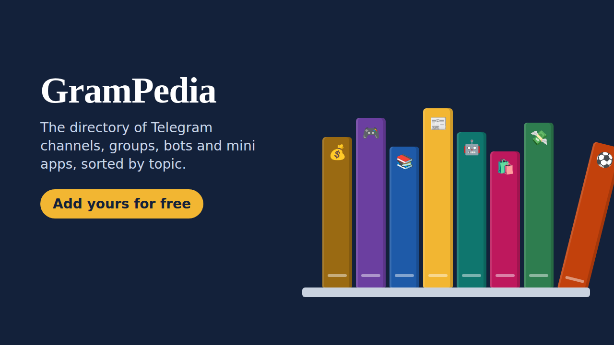

# 📚 GramPedia

### The free directory of Telegram channels, groups, bots and mini apps

Find the best Telegram channels, groups, bots and mini apps, sorted by topic and reviewed by a human. 
Got your own? **Add it for free in 1 minute.**

 

  

 

## ✨ What you will find

<table>
<tr>
<td align="center" width="25%">📢 <b>Channels</b> News, crypto, memes, sports, tech and more</td>
<td align="center" width="25%">👥 <b>Groups</b> Communities to chat and meet people</td>
<td align="center" width="25%">🤖 <b>Bots</b> Useful, fun and AI bots</td>
<td align="center" width="25%">📱 <b>Mini apps</b> Games, tools and apps that open right inside Telegram</td>
</tr>
</table>

Every listing is **checked by a human** before it goes live, with a clear description, its main languages and its audience. No fake links, no scams, no adult content.

## 🗂️ Browse by topic

| | Topic | | Topic |
|:-:|---|:-:|---|
| 💰 | [Crypto & finance](https://jeremstyke.github.io/grampedia/topic/crypto/) | 😂 | [Fun & memes](https://jeremstyke.github.io/grampedia/topic/fun/) |
| 💸 | [Earn money](https://jeremstyke.github.io/grampedia/topic/earn/) | 📰 | [News](https://jeremstyke.github.io/grampedia/topic/news/) |
| 🎮 | [Games](https://jeremstyke.github.io/grampedia/topic/games/) | ⚽ | [Sports](https://jeremstyke.github.io/grampedia/topic/sport/) |
| 🤖 | [Tech & AI](https://jeremstyke.github.io/grampedia/topic/tech/) | 🎬 | [Music, movies & series](https://jeremstyke.github.io/grampedia/topic/media/) |
| 📈 | [Business & marketing](https://jeremstyke.github.io/grampedia/topic/biz/) | 🌿 | [Lifestyle & health](https://jeremstyke.github.io/grampedia/topic/life/) |
| ✨ | [Other](https://jeremstyke.github.io/grampedia/topic/other/) | | |

## 🚀 Add your channel, group, bot or mini app

1. Open **[@Grampedia_bot](https://t.me/Grampedia_bot?start=src_github)** on Telegram
2. Add yours and fill in the name, the description, the topic and the main languages
3. A human reviews it, then it goes live in the mini app, on [the website](https://jeremstyke.github.io/grampedia/) (indexed by Google) and on [our channel](https://t.me/grampediadirectory)

It is **100% free**. Once it is approved, you can also **boost it for 24 hours** to show it at the top of the directory, just by watching a short ad.

## 💡 Why GramPedia

- 🌍 **85 languages**: each listing shows its main languages, and the app is translated into yours
- 🔎 **Search and filters** by type and topic
- 🧑‍⚖️ **Human review**: every listing is read before it goes live
- 🏆 **Top listings** sorted by audience
- 📤 **A page for each listing** on the website, easy to share on Telegram, WhatsApp or X
- 🆓 **Free**, for the people who browse and for the people who add their own

## ❓ FAQ

<b>How do I find good Telegram channels?</b>

 
Open the <a href="https://t.me/Grampedia_bot/app">GramPedia mini app</a> or <a href="https://jeremstyke.github.io/grampedia/">the website</a>, pick a topic and a language, and browse the listings. Every one of them was checked by a human.

<b>What is a Telegram mini app?</b>

 
A mini app is a web app that opens directly inside Telegram, with nothing to install: games, tools, shops and more. GramPedia lists them next to channels, groups and bots.

<b>How long does the review take?</b>

 
Listings are reviewed within 7 days, usually much sooner. If a change is needed, you get a message in your language explaining what to fix.

<b>Why was my listing refused?</b>

 
The most common reasons: the description does not explain what people will find, it contains links or @mentions, it lists languages it does not really use, or the content is adult, illegal or misleading. You get the reason and can send it again.

 

**[Website](https://jeremstyke.github.io/grampedia/)** · **[Mini app](https://t.me/Grampedia_bot/app)** · **[Bot](https://t.me/Grampedia_bot?start=src_github)** · **[Channel](https://t.me/grampediadirectory)**

Made by <a href="https://t.me/jeremstyke">@jeremstyke</a>

Telegram directory · Telegram channels list · Telegram groups · Telegram bots · Telegram mini apps · best Telegram channels by topic

